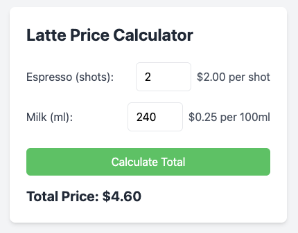

# Calculatte - the Latte Price Calculator ☕️

A simple demonstration project showcasing a calculator for determining the total price of latte ingredients. This project serves as an example of:

- Modern JavaScript module organization
- Unit testing with Jest
- Tailwind CSS implementation
- Metric system usage in web applications

## Project Structure

- `calculator.js` - Core calculation logic
- `calculator.test.js` - Unit tests for the calculator
- `index.html` - User interface implementation
- `package.json` - Project configuration and dependencies

## Features

- Calculates total price based on:
  - Number of espresso shots
  - Volume of milk (in milliliters)
- Uses metric measurements
- Modern, responsive UI with Tailwind CSS
- Comprehensive unit tests

## Note

This is a demonstration project created for educational purposes. The code is not intended for production use but rather serves as an example of modern web development practices. 